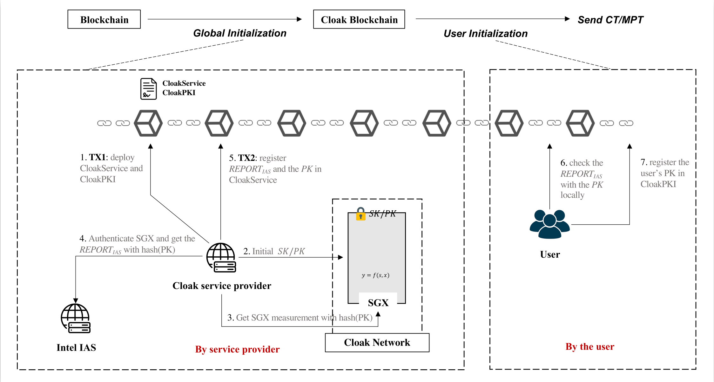

=================================
Cloak Blockchain
=================================
The initialization of Cloak Blockchain include two parts: Global Initialization and User Initialization,
for Global Initialization, we have described in `Initialize Cloak Network on Blockchain <https://oxhainan-cloak-docs.readthedocs-hosted.com/en/latest/tee-blockchain-architecture/initialize-cloak-network-on-blockchain.html>`__.
In this section, we will focus on User Initialization and interacting with Cloak Network.

As `cloak-by-examples <https://oxhainan-cloak-docs.readthedocs-hosted.com/en/latest/started/quick-start.html#cloak-by-examples>`__ described,
we use a demo program to finish the next steps for User initialization and interacting with Cloak Network,
now we will separate there steps, explain why and how to do that for every step.

Deploy Public Key
************************
Before executing an MPT, if you are the owner of some state data (*e.g.*, ``_manager`` in Demo contract), and you need to register your public key to the CloakService contract.

Deploy Public Contract
************************
The public_contract.sol needs to be deployed to a public blockchain for saving states(encrypted if private),
cloak-tee will pull old states from public contract and update states into private contract before running the Cloak contract.
After transaction completed, the new states from private contract will be synchronized to public contract,
then users can check the transaction result.

It is same as any normal blockchain contract to deploy public_contract.sol, you can use Web3 or other methods.

Deploy Private Contract
************************
The private_contract.sol needs to be deployed to Cloak Network for computing Cloak contract.
The private contract is almost the same as raw cloak contract, which is a standard Solidity contract and has two extended functions(``get_states()`` and ``set_states()``).

Usage: `Deploy Private Contract <https://oxhainan-cloak-docs.readthedocs-hosted.com/en/latest/deploy-cloak-smart-contract/deploy.html#deploy-a-solidity-contract>`__.

Bind Privacy Policy
************************
Because private_contract.sol is a standard Solidity contract,
which means it don't include any **owner** information,
but states need to be encrypted for synchronizing to public Blockchain,
so policy.json play a role to specify the owner and others information for states.

Usage: `sendPrivacyTransaction <https://oxhainan-cloak-docs.readthedocs-hosted.com/en/latest/deploy-cloak-smart-contract/deploy.html#sendprivacytransaction>`__.

Send Transaction
***********************
There are two kind Cloak transaction: CT(Confidential Transaction) and MPT(Multi-Party Transaction),
CT is special case that only involves one party of MPT for now,
so we will focus on describing MPT.

An MPT needs a proposer to send a proposal transaction to Cloak Network,
and Cloak Network will generate an MPT id for the transaction,
participants who are interested in that transaction will send their transaction to participate it with the generated MPT id.

Usage: `sendMultiPartyTransaction <https://oxhainan-cloak-docs.readthedocs-hosted.com/en/latest/deploy-cloak-smart-contract/deploy.html#sendmultipartytransaction>`__.

=================================
Cloak Client
=================================

Install
************************
To deploy the private contract, send policy to cloak-tee and execute MPT in it, cloak-client is a good tool that implements web3 provider.

.. note::

   nodejs should be upgrade to v17.0.1 or latest version.

Install cloak-client:

.. code::

   npm install OxHainan/cloak-client

Cloak Web3
**********************
Cloak-client is an extended web3, so the usage of cloak-client is the same as web3 except Cloak module.

Get web3 Object and set CloakProvider:

.. code::

   const cloak = require('cloak-client');

   const httpsAgent = new https.Agent({
       rejectUnauthorized: false,
       ca: <CCF network ca>,
       cert: <CCF USER cert>,
       key: <CCF USER PK>,
   });

   var web3 = new Web3()
   // "https://127.0.0.1:8000" is a CCF(cloak-tee) URI
   web3.setProvider(new cloak.CloakProvider("https://127.0.0.1:8000", httpsAgent, web3))

Deploy a Solidity Contract
****************************

.. code::

    var contract = new Contract(jsonInterface, address);

    contract.methods.somFunc().send({from: ....})
    .on('receipt', function(){
        ...
    });

sendPrivacyTransaction
***********************

.. code::

    web3.cloak.sendPrivacyTransaction({
        account: account,
        params: {
            to: <PRIVATE CONTRACT ADDRESS>,
            codeHash: <HASH OF PRIVATE CONTRACT>,
            verifierAddr: <PUBLIC CONTRACT ADDRESS>,
            data: web3.utils.Hex(<POLICY FILE DATA>)
        }
    })

The return value is a Policy HASH.

sendMultiPartyTransaction
**************************

.. code::

   return web3.cloak.sendMultiPartyTransaction({
      account: account,
      params: {
          nonce: <NONCE>,
          to: <PRIVATE CONTRACT ADDRESS OR MPT ID>,
          data: <CALL DATA JSON>
      }
   })

* ``nonce``: same as Ethereum nonce.
* ``to``: if ``to`` is private contract address, that means to propose an MPT transaction, otherwise, that means to participate an MPT(which id is `<MPT ID>`).
* ``data``: it includes the function what you want to call and input arguments, it looks like:

  .. code::
    
    {
        "function": "getSum",
        "inputs" : { 
            "_a": "100", "_b": "201"
        }
    }

Executed MPT will not get the result immediately, it will return an id of that MPT regardless of proposing or participating.
You need to call ``getMultiPartyTransaction()`` to check the MPT status and the result.

getMultiPartyTransaction
**************************

.. code::

   web3.cloak.getMultiPartyTransaction({id: <MPT ID>})

