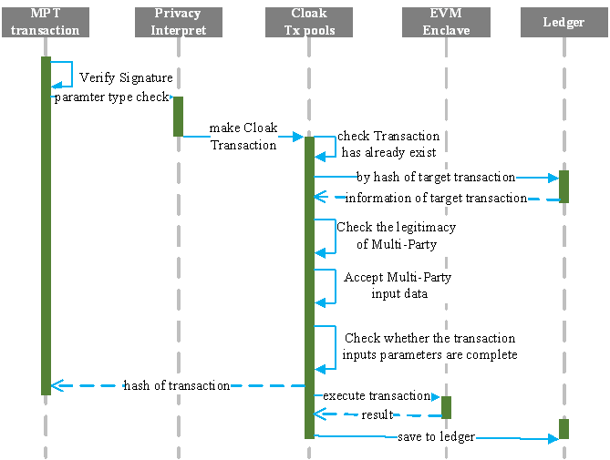

=================================
EVM-enabled Blockchain
=================================

a blockchain support Solidity smart contracts

=================================
Cloak Network
=================================

The flowing diagram shows a basic cloak network made of 3 nodes. 
All nodes run the same application inside an enclave. The effects of user 
and member transactions are eventually committed to a replicated encrypted ledger. 
A consortium of member is in charge of governing the network.

.. image:: ../imgs/cloak-network.svg
    :width: 1000px
    :alt: Cloak-Network
    :align: center

**1. network and nodes**

A cloak network consists of several nodes, each running on top of a 
Trusted Execution Environment (TEE), such as Intel SGX. At the same time, 
a cloak network is decentralized and highly-available.

Nodes are run and maintained by Operators. Operators are in charge of operator 
a cloak network, (e.g., adding or removing nodes). However, nodes must be trusted 
by the consortium of members before participating in a cloak network.

**2. Application**

Each node runs the same application, written in C++. An application is a collection 
of endpoints that can be triggered by trusted Users’ HTTP commands over TLS.

Each endpoint can mutate or read the in-enclave-memory Key-Value Store that is replicated 
across all nodes in the network. Changes to the Key-Value Store must be agreed by a variable 
number of nodes, depending on the consensus algorithm selected BFT, before being applied.

The Key-value Store is a collection of maps (associating a key to a value) that are defined 
by the application. These maps can be private (encrypted in the ledger) or public (integrity-protected 
and visible by anyone that has access to the ledger.

**3. Ledger**

All changes to the Key-Value Store are encrypted and recorded by each one of the networks 
to disk to a decentralized auditable ledger. The integrity of the ledger is guaranteed 
by a Merkle Tree whose root is periodically signed by the current primary/ledger node.

**4. Governance**

A cloak network is governed by a consortium of Members. The scriptable Constitution, 
recorded in the ledger itself, defines a set of rules that members must follows.

Members can submit proposals to modify the state of the Key-Value Store. 
For example, members can vote to allow a new trusted agent to issue requests to the 
application or to add a new member to the consortium.

**5. Workflow of transact**

.. image:: ../imgs/cloak-framework.svg
    :width: 1000px
    :alt: Cloak-Framework
    :align: center

* Privacy Interpreter, complete privacy check for transaction
* Key Management Enclave, provide data encryption and decryption
* EVM Enclave, confidential smart contract execution modules

---------------
Privacy policy
---------------

Privacy policy is a model parameter generated based on the compilation of confidential smart contract, 
which contains the inputs and outputs expression methods of public variables and public functions in the smart contract.
As follows:

.. code-block ::

    {
        "policy": {
            "contract":"SupplyChain",
            "states": [{
                "name": "balances",
                "type": "mapping(address=>uint256)",
                "owner": "mapping(address!x=>uint256@x)"
            }],
            "functions": [{
                "name": "settleReceivable",
                "inputs": [{
                    "name": "payee",
                    "type": "uint256",
                    "owner": "all"
                }, {
                    "name": "amount",
                    "type": "uint256",
                    "owner": "tee" 
                }],
                "read": [{
                    "name": "balances"
                    "keys": [
                        "payee", 
                    ]}, 
                ],
                "mutate": [{
                    {
                        "name": "balances",
                        "keys": [
                            "msg.sender"
                        ]
                    },
                }],
                "outputs": [{
                    "name": "",
                    "type": "uint256",
                    "owner": "all"
                }]
            }]
        }
    }

* contract, indicates the name of the confidential smart contract

* states 

    States records all types of contract data state variables, The meaning of the ``owner`` field is

    * ``owner: "all"`` is defaults value, means that anyone can query the data and store it on BlockChain in plaintext.

    * ``owner: id``, means that the owner of data is ``id``, ``id`` type is ``address``. 
      Only user has verified the identity of the ``id`` (e.g., digital signature) can be allowed to read the data. 
      Therefore, the value of data is private and crypted it before export cloak (e.g., synchronized data to BlockChain).

    * ``owner: "mapping(address!x=>uint256@x)``, statement of the mapping ``key`` is temporary variable ``x``, 
      and flag the owner of ``value`` is ``x``. the same as ``id``.

    .. note ::

        Temporary variable ``x`` is only valid in the mapping declaration, e.g., in a contract, 
        allow ``mapping(address!x => uint256@x)`` and ``mapping(address!x => mapping(address => uint256@x))`` can be valid 
        at the same time, because the scope of ``x`` is limited to their respective mapping.

* functions

    functions is an array collection, mark the inputs and outputs expressions of a single function, as shown below

    * ``name``, is a name of function

    * ``inputs``, input parameters of the function, each input contains the variable ``name``, ``type``, and ``owner`` of the parameter

    * ``read``, record the name of the contract data state variable required in current function contract code, in order to synchronize data
      with BlockChain.

    * ``mutate``, the contract data state binding relationship of owner of data ``id`` in this function

    * ``outputs``, output function execution result in EVM

* privacy transaction

Privacy transaction is mainly to complete the registration of privacy policy, in order to find the corresponding privacy model in the next Multi-Party transaction.
In cloak, one privacy policy can correspond to multiple confidential smart contract, but a multiple confidential smart contract only belongs to one privacy policy.
When processing privacy transaction, cloak will check the validity of parameters of the policy in the Privacy Interpreter. And then, 
check the privacy policy has already exist and if it's exist, it will check binding relationship between privacy policy again. finally, set the binding relationship 
between privacy policy and save to ledger.

------------------------
Multi-Party transaction
------------------------

In cloak network, users’ private transactions are divided into confidential transaction and 
Multi-Party Transaction. Confidential transaction can be executed normally without multi-Party 
participation. 

Suppose Co.1 (Corporate) uses the privacy mechanism in the nodes to protect his 
private data, he can need to deploy the corresponding confidential smart contract and privacy 
policy to BlockChain and cloak networks respectively. 

When Co.1 commit a private transaction, the nodes will check that based privacy policy 
target function to divided the transaction is confidential transaction or Multi-Party 
Transaction in the Privacy Interpreter. If it belongs to the former, it will enter 
the EVM execution, otherwise it will continue to wait for Multi-Party (e.g., Co.2 or himself) 
to complete the input of private data. 

As the nodes of TEE is stateless, before the transaction enters the EVM execution, 
the latest contract data state of the privacy smart contract needs to be synchronized 
with the BlockChain and decrypted in the Key Management Enclave. At the same time, 
the legality of the user's inputs of private data will be checked by the privacy smart contract.

When transaction involves multiple parties, cloak will check the legality of Multi-Party and accept
their inputs data. Then, check whether transaction inputs parameters are complete. if not, it can wait
for other Multi-Party. finally, take transaction into EVM Enclave extension and save it to ledger.