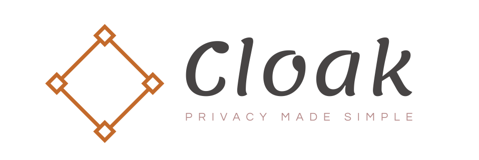
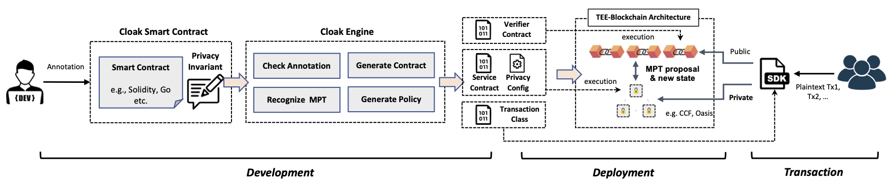

=============================
Introduction
=============================

-------------------------------
What is Cloak?
-------------------------------

Cloak is a pluggable and configurable framework for developing 
and deploying confidential smart contracts. 
Cloak allows users to specify *privacy invariants* 
(what is private data and to who is the data private) in a 
declarative way. Then, it automatically generate runtime with verifiably 
enforced privacy and deploy it to the existing EVM-enabled platforms 
(e.g., Ethereum) and TEE devices to enable the confidential smart 
contract. 

The key capability of Cloak is to allow developers to implement and deploy 
practical solutions to *Multi-Party Transaction* (MPT) problems, 
i.e., to transact with secret functions parameters and states owned by different 
parties by simply *specifying* it.

In our evaluation on both 
examples and real-world applications, developers manage 
to deploy business services on blockchain in a concise 
manner by only developing Cloak smart contracts, whose 
size is less than 30% of the deployed ones, and the gas cost 
of deployed MPTs reduced by 19%. 

The Cloak is an ongoing project aiming to become a chain-agnostic 
privacy infrastructure of the blockchain ecology. We are always calling for
talented, self-motivated developers, researchers or students 
excited about our vision. Let us make it together.

------------------
Cloak Overview
------------------

Cloak is designed to work with *TEE* and EVM-enabled blockchain. 
It initializes the blockchain in a pluggable manner to become a new architecture, 
where the blockchain and its clients are enhanced to be the Cloak Blockchain 
and the Cloak Client respectively, and the Cloak Network is added by Cloak. 

The figure followed shows the workflow of Cloak to develop, deploy the 
cnfidential smart contract and send private transaction, including MPT. 
It is mainly divided into three phases, *development*, *deployment* and *transaction*. 

In the *development* phase, we provide a domain-specific annotation 
language for developers to express privacy invariants. 
Developers can annotate privacy invariants in a Solidity smart 
contract intuitively to get a Cloak smart contract. 
The core of the development phase is *Cloak Engine*, which checks the correctness and 
consistency of the privacy invariants annotation, then generates the *verifier 
contract (V)*, *private contract (F)*, *privacy policy (P)* and the *transaction class*. 

In the *deployment* phase, Cloak helps developers deploy generated code to specified the
blockchain and the *Cloak Executors (E)* in the Cloak Network, where the verifier contract is deployed to the blockchain, 
the private contract and privacy policy is deployed to Cloak Network and the transaction 
class is held in Cloak Client.  

In the *transaction* phase, users use the transaction class of Cloak Client to interact 
with the blockchain and Cloak Network to send private transactions, as well as the MPT.

------------------
Advanced Features
------------------

The main features of Cloak include:

- **PRT/MPT-Enabled**, support the private transaction (PRT) and Multi-Party Transaction (MPT), which take private functions parameters or states from different parties.
- **Mixed Contract-Enabled**, support smart contracts with mixed public, confidential and multi-party transactions without violating any of their privacy policies.
- **Easy to use**, help developers develop confidential smart contracts by only annotating the data owner in source code.
- **Easy to develop**, provision a toolchain for develop, deploy confidential smart contracts and transact with them.
- **Pluggable**, enable confidential smart contracts on EVM-enabled blockchain in a pluggable manner.

------------------
Limitations
------------------

- struct types [P1]
- User Defined Value Types, function types(for higher-order functions) [P2]
- private, import, library, interface, inheritance, using for syntax [P1]
- Events, emit statement [p1]
- after, delete expression [P1]
- Inline Assembly [P1]
- Decoder, encryption and decryption of return values [P1]
- Call other functions that read or mutated state variables [P2]
- revert, assert syntax [P2]

-------------------------------
Security Disclaimer
-------------------------------
.. warning:: 
    Cloak is an ongoing project. The security of our implementation has not been systematically reviewed yet! 
    Do not use Cloak in a productive system or to process sensitive confidential data now.
    We will keep working on Cloak, making it cool and practical step-by-step. Welcome to join us!
