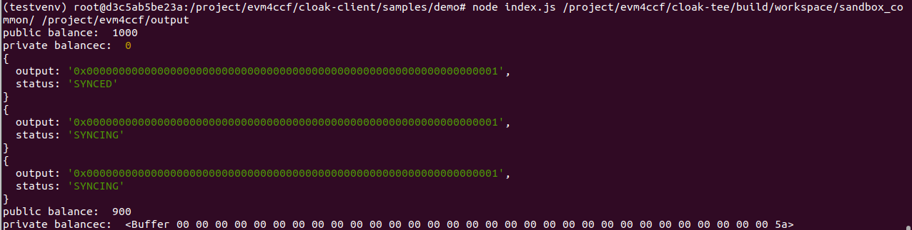

=================================
Quick Start
=================================

---------------
Prerequisites
---------------
Cloak is a framework consisting of a Cloak Network and a Cloak language compiler described as
`Introduction <https://cloak-docs.readthedocs.io/en/latest/started/introduction.html>`__.
Up to now, we haven't  deployed a public test Cloak Network to provide Cloak Service.
Please deploy a Cloak Network for yourself if you want to use Cloak,
following `Initialize Cloak Network on Blockchain <https://cloak-docs.readthedocs.io/en/latest/tee-blockchain-architecture/initialize-cloak-network-on-blockchain.html>`__.

To run the demo, we need some dependecies in our container (plytools/cloak-tee:latest).

.. code:: 

   # nodejs 
   curl -fsSL https://deb.nodesource.com/setup_16.x | sudo -E bash -
   sudo apt-get install -y nodejs
   # ganache-cli  the blockchain backend
   npm install -g ganache-cli
   # truffle
   npm install -g truffle
   # solc
   sudo apt-get install software-properties-common
   sudo add-apt-repository ppa:ethereum/ethereum
   sudo apt-get install solc
   # java
   apt install openjdk-11-jdk

Generally, we ask three terminals for container to run our demo. The terminal order is also the execution order we require.

* T1: it runs the blockchian (e.g., ganache-cli)
* T2: it runs the Cloak Network.
* T3: it represents the user's terminal, `compiles <https://cloak-docs.readthedocs.io/en/latest/started/quick-start.html#compile-cloak-contract>`__ the cloak contract and `deploys <https://cloak-docs.readthedocs.io/en/latest/started/quick-start.html#deploy-and-transaction>`__ the contract.

Here, we focus on the process of using Cloak.

---------------
Installation
---------------
There are two ways to install compiler, the easier way is to use docker or install it to any host that you want. **For convenience, we recommend the same container plytools/cloak-tee:latest in ** `Initialize Cloak Network on Blockchain <https://cloak-docs.readthedocs.io/en/latest/tee-blockchain-architecture/initialize-cloak-network-on-blockchain.html>`__. Note that, Cloak Compiler is implemented by Python 3, so you need to prepare an environment that includes an executable
Python 3 and pip3, and its version is at least greater than 3.8.

Clone code:

.. code:: 

   git clone https://github.com/OxHainan/cloak-compiler.git
   cd cloak-compiler

Install dependencies:

.. code:: 

   pip install -r install/requirements.txt

Setup:

.. code:: 

   python3 setup.py develop

--------------------
Cloak by Examples
--------------------
Using Cloak requires the following seven steps:

1. Write a Cloak contract file.
2. Compile it via Cloak Compiler to generate public_contract.sol, private_contract.sol and policy.json.
3. Register your public key to CloakService contract.
4. Deploy public_contract.sol to Cloak Blockchain.
5. Deploy private_contract.sol to cloak-tee.
6. Bind policy.json to the private contract.
7. Propose or participate a transaction.

Here we will show you how to finish there steps through `demo.cloak <https://github.com/OxHainan/cloak-client/blob/main/samples/demo/demo.cloak>`__:

A Glance of Cloak Contract
***************************

This is the *demo.cloak*, representing the Cloak contract of the first step.
Here, we pay attention to the steps of using it rather than the details. 
A detailed description is presented in `Cloak Compiler <https://cloak-docs.readthedocs.io/en/latest/develop-cloak-smart-contract/compiler.html>`__.

.. code-block::

    // SPDX-License-Identifier: Apache-2.0

    pragma cloak ^0.2.0;

    contract Demo {
        final address@all _manager;                  // all
        mapping(address => uint256) pubBalances;     // public
        mapping(address!x => uint256@x) priBalances; // private

        constructor(address manager) public {
            _manager = manager;
            pubBalances[manager] = 1000;
        }

        //  PRT-me
        //
        // @dev Deposit token from public to private balances
        // @param value The amount to be deposited.
        //
        function deposit(uint256 value) public returns (bool) {
            require(value <= pubBalances[me]);
            pubBalances[me] = pubBalances[me] - value;
            priBalances[me] = priBalances[me] + value;
            return true;
        }

        //  MPT
        //
        // @dev Transfer token for a specified address
        // @param to The address to transfer to.
        // @param value The amount to be transferred.
        //
        function multiPartyTransfer(address to, uint256 value)
            public
            returns (bool)
        {
            require(value <= priBalances[me]);
            require(to != address(0));

            priBalances[me] = priBalances[me] - value;
            priBalances[to] = priBalances[to] + value;
            return true;
        }
    }

For demonstrating the *demo.cloak*, We use the following test account as an example.

.. code::

   private key: 0x55b99466a43e0ccb52a11a42a3b4e10bfba630e8427570035f6db7b5c22f689e
   address: 0xDC8FBC8Eb748FfeBf850D6B93a22C3506A465beE

Compile Cloak Contract
**********************

After the running of cloak service, we can compile the cloak contract. For example:

.. code:: 

    cloak compile -o <OUTPUT PATH> --put-enable <CLOAK CONTRACT>
    e.g.
    cloak compile -o output --put-enable /project/evm4ccf/cloak-client/samples/demo/demo.cloak

There are four important files in the *output* directory, including contract.cloak, public_contract.sol, private_contract.sol and policy.json.

* contract.cloak: the cloak contract of your business.
* public_contract.sol: a solidity contract, it will be deployed to Blockchain.
* private_contract.sol: a solidity contract, it will be deployed to cloak-tee and be executed by eEVM in TEE environment.
* policy.json: a privacy policy definition of the Cloak smart contract binding to the private contract.

Deploy and Transaction
**********************

The remaining steps will be carried out through `cloak-client <https://cloak-docs.readthedocs.io/en/latest/deploy-cloak-smart-contract/deploy.html#cloak-client>`_.
We have writed a `sample <https://github.com/OxHainan/cloak-client/tree/main/samples/demo>`__ that uses cloak-client to show you how to register pk, deploy public/private contract, bind privacy policy and propose a PRT/MPT transaction, *etc*.

Clone cloak-client and change directory to sample/demo:

.. code::

   git clone https://github.com/OxHainan/cloak-client.git
   cd cloak-client
   npm install
   cd cloak-client/samples/demo
   npm install
   cp /project/evm4ccf/cloak-service-contract/build/contracts/CloakService.json .

Run command:

.. code::

   # CCF_AUTH_DIR: a directory that includes CCF network.cert, a user cert and pk, typically workspace/sandbox_common/ under cloak-tee build directory if you use sandbox.sh setup cloak-tee.
   # COMPILE_DIR: cloak-compiler output directory
   node index.js <CCF_AUTH_DIR> <COMPILE_DIR> 
   e.g.
   node index.js /project/evm4ccf/cloak-tee/build/workspace/sandbox_common/ /project/evm4ccf/output

More detailed usage is in the `cloak-client document <https://cloak-docs.readthedocs.io/en/latest/deploy-cloak-smart-contract/deploy.html#cloak-client>`__, and
the full sample is in the `code <https://github.com/OxHainan/cloak-client/tree/main/samples/demo>`__.

It shows the result of the successful running of the demo, meaning the execution of *multiPartyTransfer* in *index.js*.

.. Note::

  Close the proxy if you have set it, otherwise the Cloak Network fails to run.
