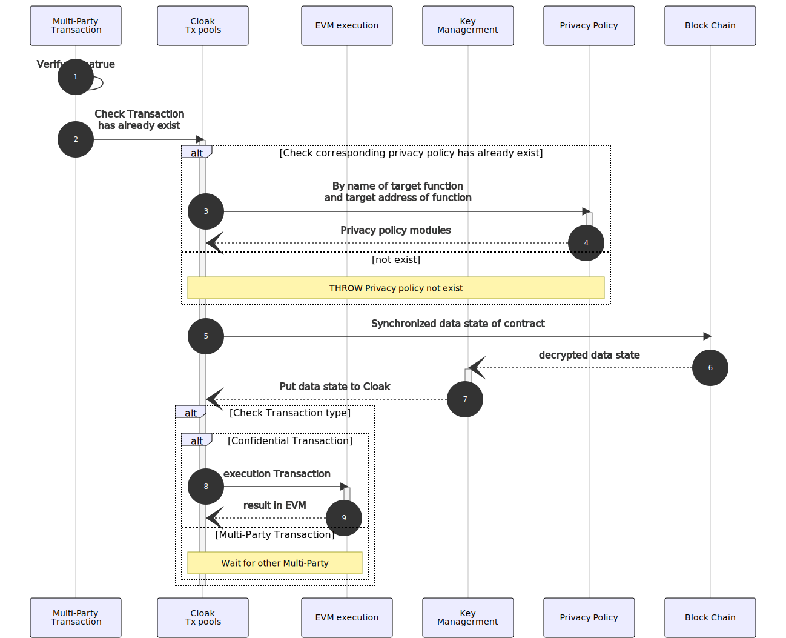
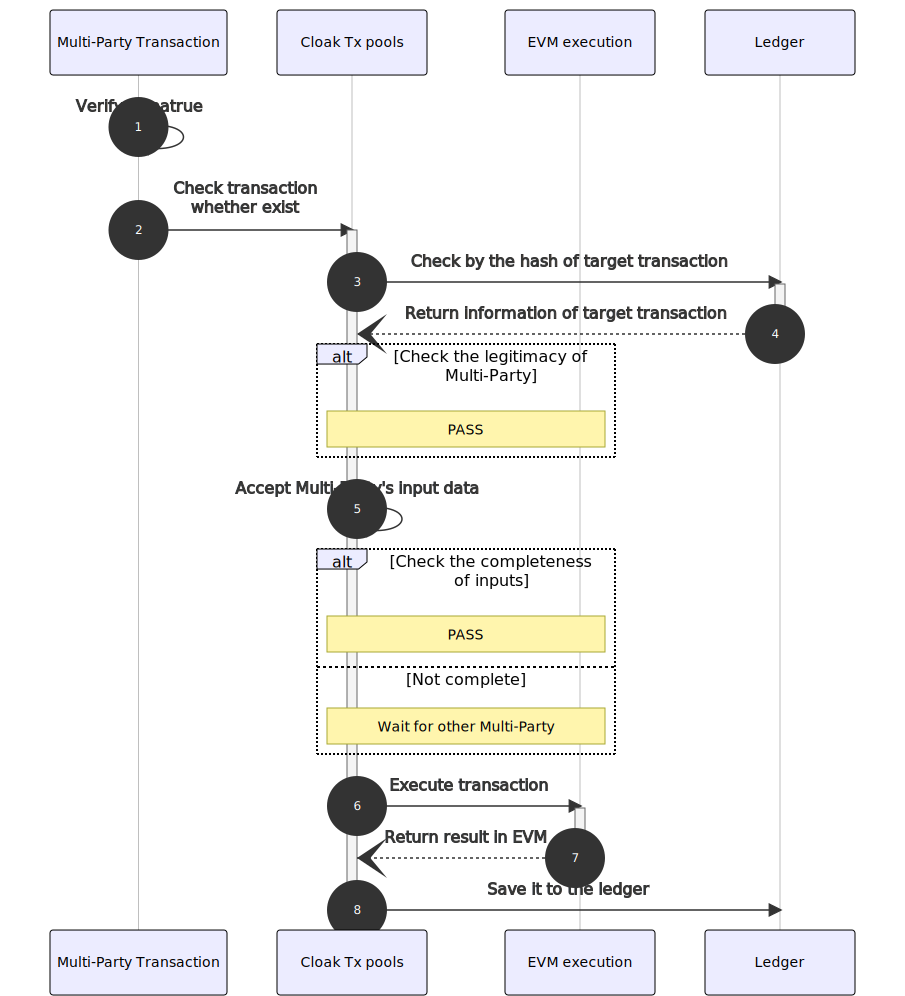

===============================
Cloak Network
===============================

********************************
Cloak Network Overview
********************************

The flowing diagram shows a basic Cloak Network made of 3 nodes. 
All nodes run the same application inside an enclave. The effects of user 
and member transactions are eventually committed to a replicated encrypted ledger. 
A consortium of members is in charge of governing the network.

.. image:: ../imgs/cloak-network.svg
    :width: 1000px
    :alt: Cloak-Network
    :align: center

Network and Nodes
------------------

A Cloak Network consists of several nodes, each running on top of a 
Trusted Execution Environment (TEE), such as Intel SGX. At the same time, 
a Cloak Network is decentralized and highly-available.

Nodes are run and maintained by Operators. Operators are in charge of operator 
a Cloak Network, (*e.g.*, adding or removing nodes). However, nodes must be trusted 
by the consortium of members before participating in a Cloak Network.

Application
-------------

Each node runs the same application, written in C++. An application is a collection 
of endpoints that can be triggered by trusted Users’ HTTP commands over TLS.

Each endpoint can mutate or read the in-enclave-memory Key-Value Store that is replicated 
across all nodes in the network. Changes to the Key-Value Store must be agreed by a variable 
number of nodes, depending on the consensus algorithm selected BFT, before being applied.

The Key-value Store is a collection of maps (associating a key to a value) that are defined 
by the application. These maps can be private (encrypted in the ledger) or public (integrity-protected 
and visible by anyone that has access to the ledger.

Ledger
---------

All changes to the Key-Value Store are encrypted and recorded by each one of the networks 
to disk to a decentralized auditable ledger. The integrity of the ledger is guaranteed 
by a Merkle Tree whose root is periodically signed by the current primary/ledger node.

Governance
------------

A Cloak Network is governed by a consortium of Members. The scriptable Constitution, 
recorded in the ledger itself, defines a set of rules that members must follow.

Members can submit proposals to modify the state of the Key-Value Store. 
For example, members can vote to allow a new trusted agent to issue requests to the 
application or to add a new member to the consortium.

********************************
Workflow of Transaction
********************************

.. image:: ../imgs/cloak-framework.svg
    :width: 1000px
    :alt: Cloak-Framework
    :align: center

* Privacy Interpreter, completes privacy parameters check for the transaction.
* Key Management Enclave, provides data encryption and decryption functions inside Enclave to protect 
  users' data information from being stolen by third parties.
* EVM Enclave, responsible for the execution of confidential smart contracts and output the execution result.

Deploy Confidential Smart Contracts
-------------------------------------
Users can write confidential smart contract based on Cloak language and compile it in the **Cloak-Compiler** to 
generate ``privacy policy`` and contract ``code``. Then, contract ``code`` can deploy to blockchain and get the contract address, marked as ``Verifier``.

Policy Binding Transaction
---------------------------

Policy binding transaction can bind ``Verifier`` and privacy policy. Privacy policy is a model parameter generated based 
on the compilation of Cloak smart contract, which contains the inputs and outputs expression methods of public variables 
and public functions in the smart contract.

The processing flow is as follows:

.. mermaid:: privacy.mmd

Policy Binding Transaction is mainly to complete the registration of privacy policy to find the corresponding privacy model in the next Multi-Party Transaction.
In Cloak, one privacy policy can correspond to multiple confidential smart contract, but a multiple confidential smart contract only belongs to one privacy policy.
When processing a Policy Binding Transaction, Cloak will 

1. check the validity of parameters of the policy in the Privacy Interpreter;
2. check whether the policy exists 

  2.1 If it exists, it will check the binding relationship between privacy policy and user;

    2.1.1 If it has already been binded, throw error. 

  2.2 If not, it will save it to the ledger;

3. set the binding relationship between privacy policy and confidential smart contract;

Multi-Party Transaction
--------------------------

In the Cloak Network, users' private transactions are divided into confidential transactions and 
Multi-Party transactions. The confidential transaction can be executed normally without multi-Party 
participation. 

The input format of the transaction is as follows:

.. code-block::

    {
        "function": "settleReceivables",
        "inputs" : [{
            "name": "payee",
            "value": "0xde0B295669a9FD93d5F28D9Ec85E40f4cb697BAe"
        }, {
            "name": "amount",
            "value": "0x1234"
        }],
    }

* ``function``: (Optional), when the user is the initiator of the transaction, this field cannot be omitted 

* ``inputs``: inputs parameter of target of function, structure array composed of ``name`` and ``value``. 

.. note::
    Due to ``value`` can only accept ``string`` types, when the variable type of ``name`` is an ``array``, it will 
    need to be converted to ``string`` types. e.g., we need to input the flowing array types data,

    .. code::

        ["0x123", "0x456"]
    
    so, we can converte it to

    .. code-block::

        '["0x123", "0x456"]'

The processing flow is as follows:

Suppose Co.1 (Corporate) uses the privacy mechanism in the nodes to protect his 
private data, he needs to deploy the corresponding confidential smart contract and privacy 
policy to blockchain and Cloak networks respectively. 

When Co.1 commits a private transaction, the nodes will check that based privacy policy 
target function to divide the transaction is confidential transaction or Multi-Party 
Transaction in the Privacy Interpreter. If it belongs to the former, it will enter 
the EVM execution, otherwise, it will continue to wait for Multi-Party (*e.g.*, Co.2 or himself) 
to complete the input of private data. 

As the nodes of TEE is stateless before the transaction enters the EVM execution, 
the latest contract data state of the private smart contract needs to be synchronized 
with the blockchain and decrypted in the Key Management Enclave. At the same time, 
the legality of the user's inputs of private data will be checked by the private smart contract.

When a transaction involves multiple parties, Cloak will check the legality of Multi-Party and accept
their inputs data. Then, Cloak checks the completeness of transaction inputs parameters. If not, it can wait
for other Multi-Party. Finally, Cloak takes the transaction into EVM execution and saves it to the ledger.
