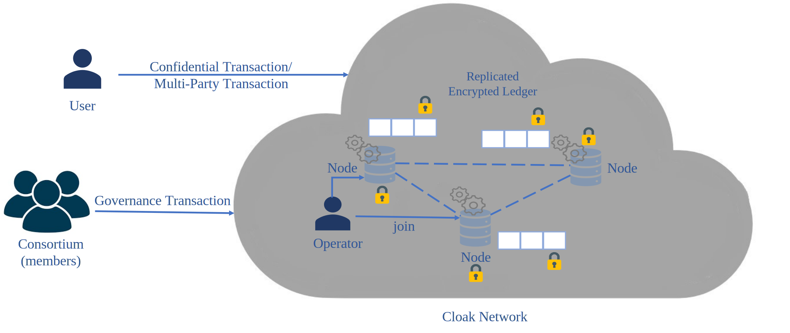
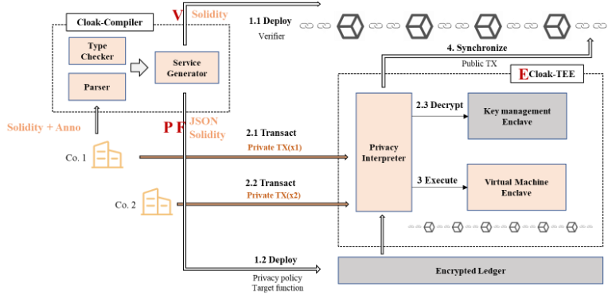
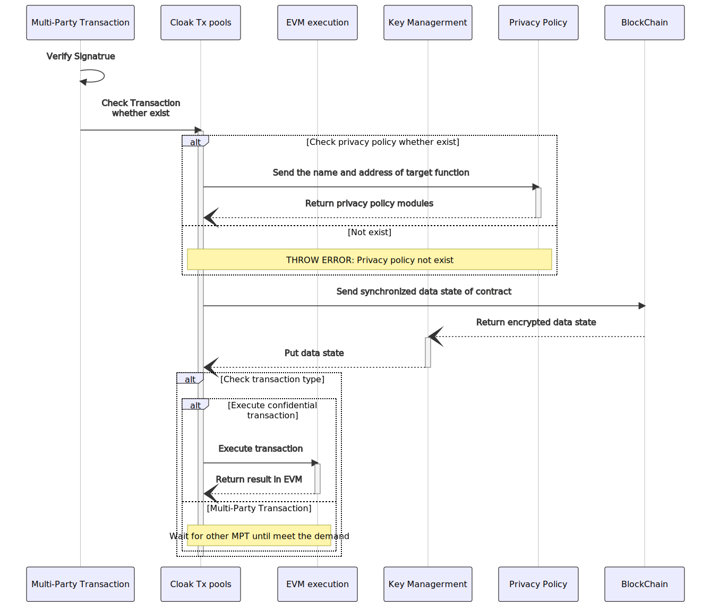

===============================
Cloak Network
===============================

Cloak Network is the network consisting of multiple Cloak Executors that hold TEE with Cloak runtime in it. Cloak Executors

- processes broadcasted requests from `cloak-client <https://oxhainan-cloak-docs.readthedocs-hosted.com/en/latest/deploy-cloak-smart-contract/deploy.html#cloak-client>`_.
- runs contracts in its TEE.
- executes the Confidential Transaction (CT) and the Multi-Party Transaction (MPT) in its TEE.
- generates proofs proving the correctness of state updates indenpendently.

Cloak Network is built on `CCF Network <https://microsoft.github.io/CCF/main/overview/index.html>`_, *i.e.*, a special CCF Network running Cloak App.

Next, we will introduce the network and its workflow in detail.

********************************
Cloak Network Overview
********************************

The flowing diagram shows a basic Cloak Network made of 3 nodes. 
All nodes run the same application inside an enclave. The effects of user 
and member transactions are eventually committed to a replicated encrypted ledger. 
A consortium of members is in charge of governing the network.

Network and Nodes
------------------

A Cloak Network consists of several nodes, each running on top of a 
Trusted Execution Environment (TEE), such as Intel SGX. At the same time, 
a Cloak network is decentralized and highly-available.

Nodes are run and maintained by Operators who in charge of operatoring 
a Cloak Network (*e.g.*, adding or removing nodes). However, nodes must be trusted 
by the consortium of members before participating in a Cloak Network.

Application
-------------

Each node runs the same application, written in C++. An application is a collection 
of endpoints that can be triggered by trusted Users’ HTTP commands over TLS.

Each endpoint can mutate or read the in-enclave-memory Key-Value Store that is replicated 
across all nodes in the network. Changes to the Key-Value Store must be agreed by a variable 
number of nodes, depending on the consensus algorithm selected BFT, before being applied.

The Key-value Store is a collection of maps (associating a key to a value) that are defined 
by the application. These maps can be private (encrypted in the ledger) or public (integrity-protected 
and visible by anyone that has access to the ledger.

Ledger
---------

All changes to the Key-Value Store are encrypted and recorded by each one of the networks 
to disk to a decentralized auditable ledger. The integrity of the ledger is guaranteed 
by a Merkle Tree whose root is periodically signed by the current primary/ledger node.

Governance
------------

A Cloak Network is governed by a consortium of Members. The scriptable Constitution, 
recorded in the ledger itself, defines a set of rules that members must follow.

Members can submit proposals to modify the state of the Key-Value Store. 
For example, members can vote to allow a new trusted agent to issue requests to the 
application or to add a new member to the consortium.

********************************
Workflow of Transaction
********************************

There are three critical components in the Cloak-TEE enables the CT and MPT.
* Privacy Interpreter, completes privacy parameters check for the transaction.
* Key Management Enclave, provides data encryption and decryption functions inside Enclave to protect users' data information from being stolen by third parties.
* EVM Enclave, responsible for the execution of confidential smart contracts and output the execution result.

Taking two cooperators as an example to explain the workflow of MPT.

1. Co.1 uses the Cloak-Complier to compiler its confidential contract and obtains verifier contract (*aka.* public contract), private contract and private policy.
2. Cloak-Compiler deploys the verifier contract to the blockchain (1.1) and deploy the rest to the Cloak Network (1.2).
3. Co.1 and Co.2 send MPT to the Cloak Network (2.1 and 2.2).
4. Privacy Interpreter checks the parameters and decryptes them with Key Management Enclave(2.3).
5. EVM Enclave executes these two transaction (3).
6. Cloak Network synchronize the final states (transaction) to the verifier contract (4).

Next, we focus on the key steps, *i.e.*, deploy confidential contracts, policy binding transaction and multi-party transaction.

Deploy Confidential Smart Contracts
-------------------------------------
Users can write confidential smart contract based on `Cloak Language <https://oxhainan-cloak-docs.readthedocs-hosted.com/en/latest/develop-cloak-smart-contract/cloak-language.html>`_ and compile it in the `cloak-compiler <https://oxhainan-cloak-docs.readthedocs-hosted.com/en/latest/develop-cloak-smart-contract/compiler.html#>`_ to 
generate privacy policy and two contracts. Then, one of contracts can deploy to blockchain and get the contract address, marked as ``Verifier``.
The other contract is the private contract deployed via `cloak-client <https://oxhainan-cloak-docs.readthedocs-hosted.com/en/latest/deploy-cloak-smart-contract/deploy.html#cloak-client>`_.

Policy Binding Transaction
---------------------------

Policy binding transaction can bind ``Verifier`` and privacy policy. Privacy policy is a model parameter generated based 
on the compilation of Cloak smart contract, which contains the inputs and outputs expression methods of public variables 
and public functions in the smart contract.

The processing flow is as follows:

.. mermaid:: privacy.mmd

Policy Binding Transaction is mainly to complete the registration of privacy policy to find the corresponding privacy model in the next Multi-Party Transaction.
In Cloak, one privacy policy can correspond to multiple confidential smart contract, but a multiple confidential smart contract only belongs to one privacy policy.
When processing a Policy Binding Transaction, Cloak will 

1. check the validity of parameters of the policy in the Privacy Interpreter;
2. check whether the policy exists 
   
   2.1 If it exists, it will check the binding relationship between privacy policy and user;
      
      2.1.1 If it has already been binded, throw error. 
   2.2 If not, it will save it to the ledger;
3. set the binding relationship between privacy policy and confidential smart contract;

Multi-Party Transaction
--------------------------

In the Cloak Network, users' private transactions are divided into Confidential Transactions (CT) and 
Multi-Party Transactions (MPT). The former is the confidential transaction involving one participant.
The latter involves multiple participants.
MPT and CT have similar processing logic, but the difference is that MPT need to wait for other's transactions.

The input format of the transaction is as follows:

.. code-block::

    {
        "function": "settleReceivables",
        "inputs" : [{
            "name": "payee",
            "value": "0xde0B295669a9FD93d5F28D9Ec85E40f4cb697BAe"
        }, {
            "name": "amount",
            "value": "0x1234"
        }],
    }

* ``function``: (Optional), when the user is the initiator of the transaction, this field cannot be omitted 

* ``inputs``: inputs parameter of target of function, structure array composed of ``name`` and ``value``. 

.. note::
    Due to ``value`` can only accept ``string`` types, when the variable type of ``name`` is an ``array``, it will 
    need to be converted to ``string`` types. e.g., we need to input the flowing array types data,

    .. code::

        ["0x123", "0x456"]
    
    so, we can converte it to

    .. code-block::

        '["0x123", "0x456"]'

Suppose Co.1 uses Cloak to execute confidential transactions.
He needs to deploy the corresponding verifier contract to the blockchain and to deploy the privacy 
policy and private contract to Cloak Network, respectively. 

The processing flow is as follows:

1. Check whether the policy exists; 
  
  1.1 If it exists, it will send the name and address of target function and get privacy policy modules;
  
  1.2 If not, it will throw an error;
2. Send synchronized data state of contract to blockchain and get the encrypted state;
3. Key Management decrypte and send it to Cloak Tx pools;
4. Check the type of transaction;
  
  4.1 If it is a CT, the execution executes it and return result in EVM. 
  
  4.2 If it is an MPT, it will wait for other MPT until meet the demand. The details will be described below.

When a transaction is MPT, Cloak will check the legality of Multi-Party and accept
their inputs data. Then, Cloak checks the completeness of transaction inputs parameters. If not, it can wait
for other Multi-Party. Finally, Cloak takes the transaction into EVM execution and saves it to the ledger.
Note that, this ledger belongs to the Cloak Network rather than blockchain.

The processing flow of MPT is as follows:

.. image:: ../imgs/multi-party-transaction.svg
    :width: 800px
    :alt: transaction-identity
    :align: center

1. Check the hash of target function and get the information of it; 
2. Check the legitimacy of parties;
3. Accept parties' input data.
4. Check whether the transaction demand meets; 
   
   4.1 If it meets, go to step 5.
   
   4.2 If not, wait until the conditions are met or run out of time.
5. The execution executes it and return result in EVM;
6. Save the result in the ledger.

Of course, Cloak will send the final state to the blockchain at the end.  
